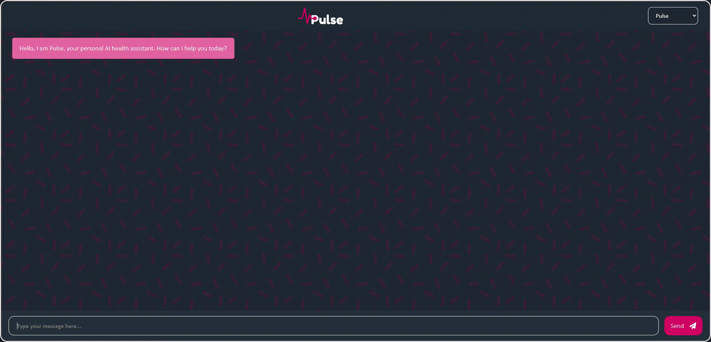
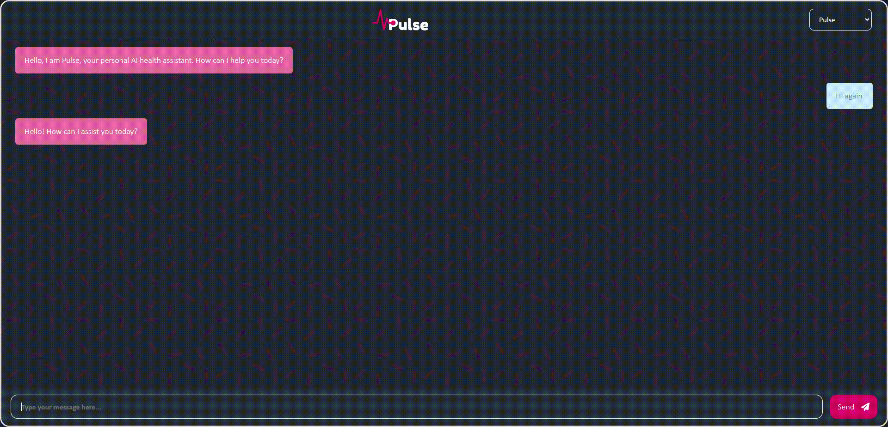
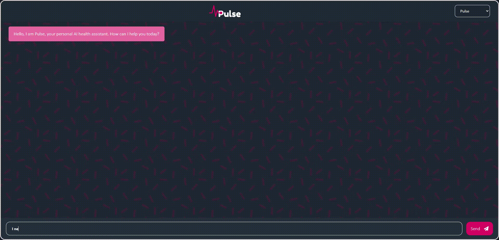
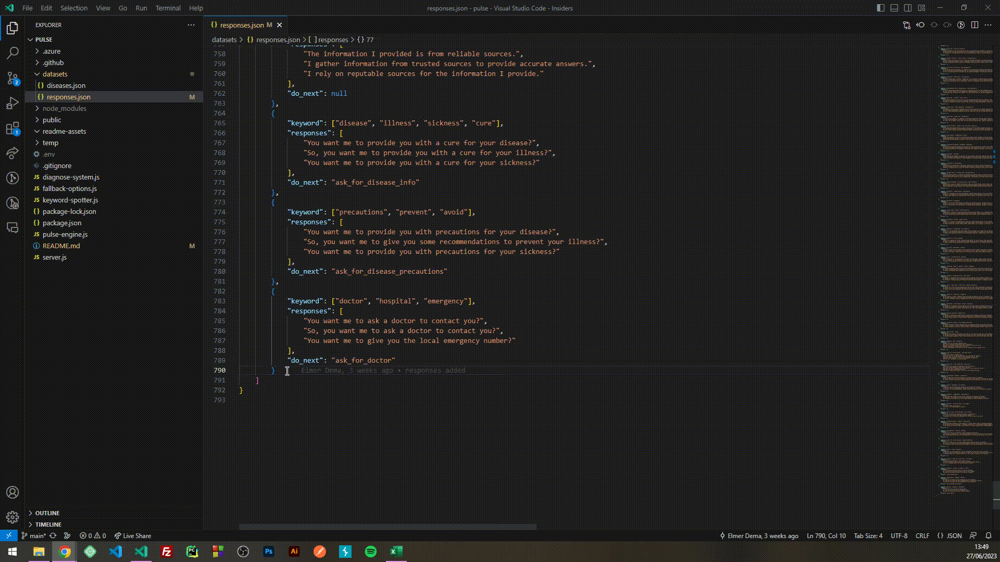
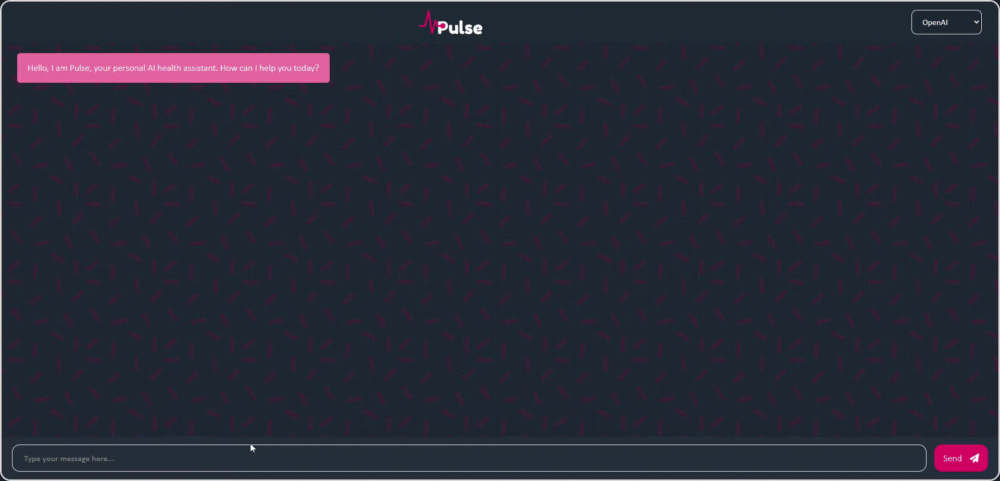

<div align="center">
<!-- Title: -->
  <h1><a href="https://pulse-ai.de/">Pulse AI</a> - Internet Technologies Project</h1>
<!-- Labels: -->
  <!-- First row: -->
  Developed by
  <!-- Second row: -->
  <br>
  <a href="https://github.com/0Shark">
    Juled Zaganjori (22206337)
  </a>
  <a href="https://github.com/elmerdema">
    Elmer Dema (22211551)
  </a>
<!-- Short description: -->
  <h4>Special thanks to Prof. Dr. Andreas Wölfl for his guidance and support throughout the project.</h4>
  <h5>Deployment through Azure found at <a href="https://pulse-ai.de/">pulse-ai.de</a></h5>
</div>

## About our idea
Pulse is a web-based chatbot that is able to hold a medical conversation with you and performing a disease diagnosis based on the symptoms you provide.<br><br>
### Diagnosis
During the diagnosis, the chatbot will give you a list of precautions, information about the disease, and a emergency number in case you need it. If you are not happy with your diagnosis you can ask for a new one and the process will restart.<br><br>
<br><br>
### Normal conversation
The chatbot is also able to perform a normal medical conversation with you, such as greeting you, asking you how you are doing, saying goodbye, giving advice and recommendations on how to stay healthy.<br><br>
<br><br>
### Other features
Pulse can also give you advice on different topics such as nutrition, exercise, mental health, emergency situations, and more.<br><br>
<br><br>
### Extending the chatbot
The conversation responses can be easily extended by the user by adding more responses to the JSON dataset `responses.json`.<br>
You provide the keywords, different responses and set the do_action to null.<br>
Advanced features: In case you want to introduce a new action feature you would need to modify the code in the `pulse-engine.js` file.<br><br>
<br><br>
### OpenAI engine
You can also switch between the pulse engine and the OpenAI engine through the dropdown on the top right corner of the chatbot.<br><br>
<br><br>

## Getting Started
#### Clone the repository
```bash
git clone https://github.com/Dialogue-Developers/pulse.git
```
#### Install dependencies
```bash
npm install
```
#### Run the server
```bash
npm start
```

## Editing the chatbot engine
#### Adding new responses
You can change the responses of the chatbot by editing the `responses.json` file.<br>
The file contains a list of responses that the chatbot will use to respond to the user.<br>
The responses are divided into several action categories called do_action: `null` (normal), `diagnose`, `ask_for_disease_info`, `ask_for_disease_precautions`, `ask_for_doctor`, `end_conversation` etc.<br>
#### Adding new diseases
You can add new diseases to the chatbot by editing the `diseases.json` file.<br>
## Editing the UI
You can edit the UI of the chatbot by cloning the repo somewhere else and switching to the `dev-front-end` branch.<br>
```bash
git clone https://github.com/Dialogue-Developers/pulse.git
git checkout dev-front-end
```

After you are done editing the UI you can push the changes to the `dev-front-end` branch.<br>

Run the following command to build the app:
```bash
npm run build
```
Copy the build folder and paste it into the `public` folder of the main branch.<br>
After that you can push the changes to the main branch and the app will be deployed automatically by our Azure pipeline.<br>

## Deployment
The app is deployed on Azure and can be found at [pulse-ai.de](https://pulse-ai.de/) or [pulseailive.azurewebsites.net](https://pulseailive.azurewebsites.net/) (backup link).<br>
The deployment is done automatically through Azure pipelines.<br>
The pipeline is triggered when a new commit is pushed to the `main` branch.<br>
The pipeline will build the app and deploy it to the Azure web app.<br>

## Responsibilites
#### Juled Zaganjori
* Pulse engine
* Fallback options
* Deployment
* Keyword spotting for the diagnosis
* OpenAI engine

#### Elmer Dema
* Design & Layout
* React components
* Keyword spotting for the normal conversation
* Creating the dataset for the knowledge base

## Backend built with
* [Node.js](https://nodejs.org/en/) - JavaScript runtime environment
* [Express.js](https://expressjs.com/) - Web framework for Node.js
* [Socket.io](https://socket.io/) - Real-time communication engine
* [OpenAI API](https://beta.openai.com/) - API for the OpenAI engine
## Frontend built with
* [Bootstrap](https://getbootstrap.com/) for the essential styling + Custom CSS for the chat UI
* [React.js](https://reactjs.org/) - JavaScript library for building user interfaces

## Contributing
Pull requests are welcome. For major changes, please open an issue first to discuss what you would like to change.<br>